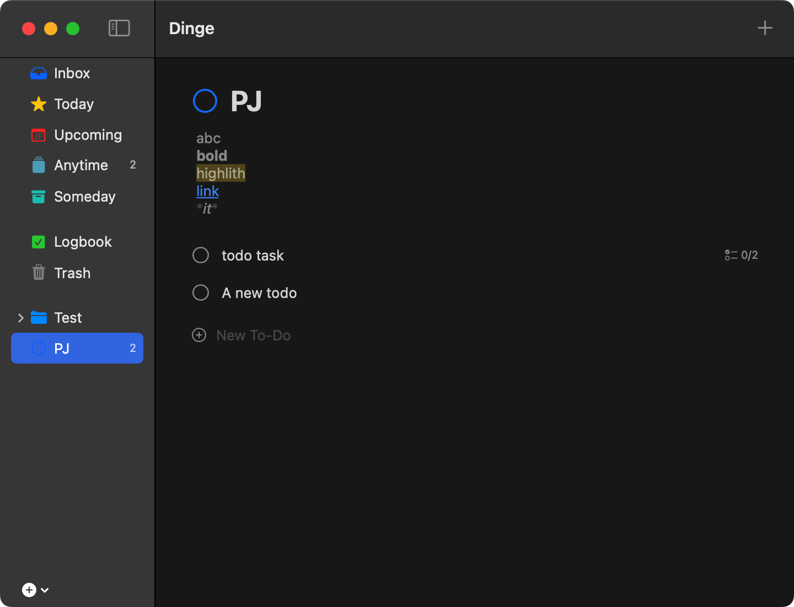

# Dinge

An open-source **Things 3** alternative for macOS, built with SwiftUI.



## Features

- **GTD workflow** — Inbox, Today, Upcoming, Anytime, Someday, Logbook, Trash
- **Things 3-style UI** — two-column layout (sidebar + content), tasks expand inline as focused cards
- **Checklists** — add subtask-style checklist items within each task card
- **Deadline vs. Scheduled dates** — clear distinction between "when to work on it" and "when it's due"
- **Projects & Areas** — organize tasks hierarchically
- **Markdown notes** — full block-level rendering (headings, code blocks, images, lists, blockquotes, links)
- **Inline #tagging** — type `#tagname` in titles or notes; tags are auto-extracted and shown as pills, with autocomplete for existing tags
- **iCloud sync** — file-based JSON storage in a user-configurable directory; place it in iCloud Drive for seamless cross-device sync
- **Native macOS UI** — NavigationSplitView, smooth animations, keyboard shortcuts

## Architecture

```text
Dinge/
├── Models/
│   ├── DingeModels.swift        # Task (with checklist), Project, Area, Tag
│   ├── DataStore.swift          # JSON file persistence + iCloud path
│   └── SidebarDestination.swift
├── Views/
│   ├── SidebarView.swift        # Smart lists + areas/projects
│   ├── MainContentView.swift    # Project header + scrollable task list
│   ├── TaskRowView.swift        # Collapsed row: checkbox, title, badges
│   ├── TaskCardView.swift       # Expanded inline card: checklist, notes, dates, tags
│   ├── MarkdownView.swift       # Block-level Markdown renderer
│   ├── SettingsView.swift       # Storage path configuration
│   └── TaskDetailView.swift     # FlowLayout utility
├── ContentView.swift            # 2-column NavigationSplitView
└── DingeApp.swift               # App entry point
```

**Storage**: Each entity is a JSON file under `tasks/`, `projects/`, `areas/`, `tags/` subdirectories. Default location is `~/Library/Application Support/Dinge/`. Change it in **Settings → Storage Location** to any iCloud Drive folder.

## Requirements

- macOS 15.7+
- Xcode 26.2+

## License

Open source.
